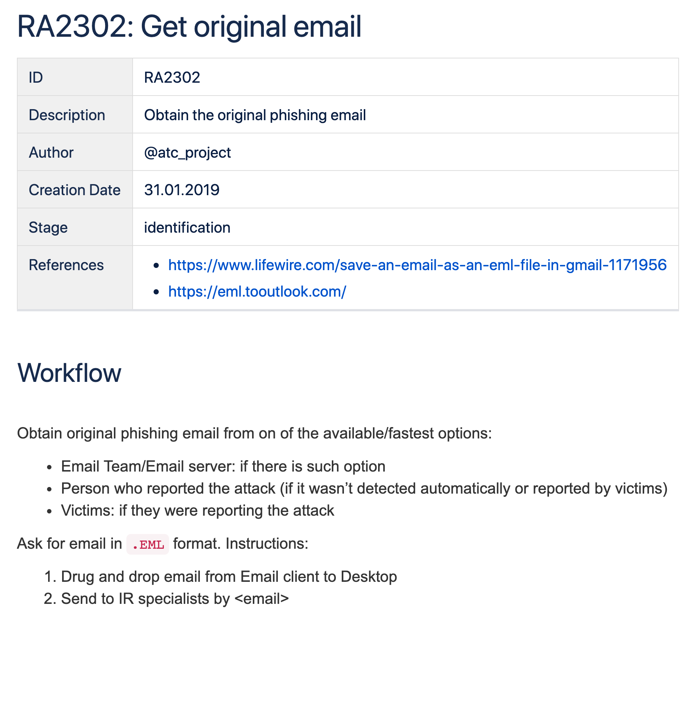
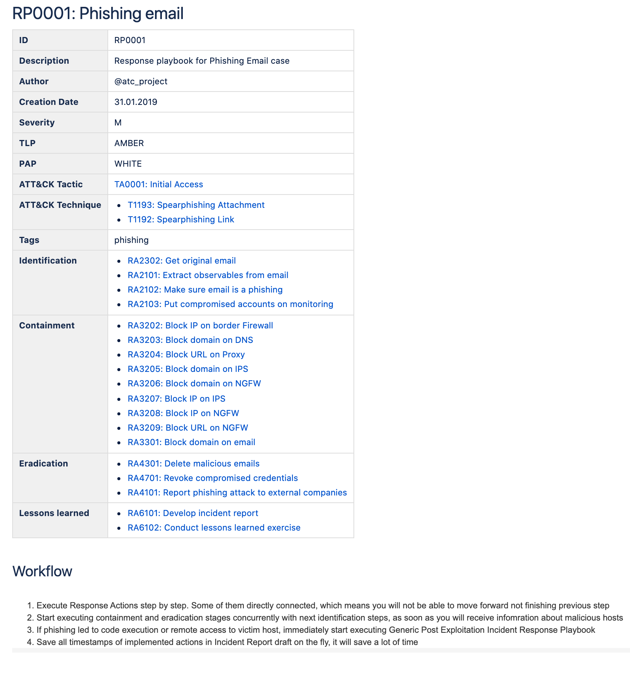

# ATC RE&CT


The project represents the following:

1. A [framework](https://atc-project.github.io/atc-react/) — knowledge base of actionable Incident Response techniques
2. A community-driven [collection](docs/Response_Playbooks) of Security Incident Response Playbooks
3. A data source of the [Atomic Threat Coverage](https://github.com/atc-project/atomic-threat-coverage) framework

## The RE&CT Framework

is designed for accumulating, describing and categorizing actionable Incident Response techniques. 

The main use cases are:

- Prioritize development for Incident Response capabilities
- Gap analysis — determine "coverage" of a set of Incident Response capabilities

There is a [website](https://atc-project.github.io/atc-react/) where you can observe all analytics.  

RE&CT's philosophy is based on the [MITRE's ATT&CK](https://attack.mitre.org/) framework.  
The columns represent [Incident Response stages](https://atc-project.github.io/atc-react/responsestages/).  
The cells repsresent [Response Actions](#response-action).  

| Preparation                                           | Identification                                   | Containment                             | Eradication                                        | Recovery                            | Lessons Learned                        |
|:-----------------------------------------------------:|:------------------------------------------------:|:---------------------------------------:|:--------------------------------------------------:|:-----------------------------------:|:--------------------------------------:|
| [**Take trainings**]                                  | [**Get original email**]                         | [**Block domain on email**]             | [**Delete malicious emails**]                      | [Reinstall host from golden image*] | [**Develop incident report**]          |
| [**Practice**]                                        | [**Extract observables from email**]             | [**Block external IP address**]         | [**Revoke compromised credentials**]               |                                     | [**Conduct Lessons Learned exercise**] |
| [Raise personnel awareness*]                          | [**Make sure email is a phishing**]              | [**Block internal IP address**]         | [**Report phishing attack to external companies**] |                                     |                                        |
| [Make personnel report suspicious activity*]          | [**Put compromised accounts on monitoring**]     | [**Block external domain**]             | [**Report incident to external companies**]        |                                     |                                        |
| [Set up relevant data collection*]                    | [Analyse filehash*]                              | [**Block internal domain**]             | [Remove file from host*]                           |                                     |                                        |
| [Set up a centralized long-term log storage*]         | [Analyse IP*]                                    | [**Block external URL**]                |                                                    |                                     |                                        |
| [Develop communication map*]                          | [Analyse macOS Mach-O*]                          | [**Block internal URL**]                |                                                    |                                     |                                        |
| [Make sure there are backups*]                        | [Analyse MS Office file*]                        | [**Block port external communication**] |                                                    |                                     |                                        |
| [Get network architecture map*]                       | [Analyse PDF*]                                   | [**Block port internal communication**] |                                                    |                                     |                                        |
| [Get access control matrix*]                          | [Analyse Unix ELF*]                              | [**Block user external communication**] |                                                    |                                     |                                        |
| [Develop assets knowledge base*]                      | [Analyse URI*]                                   | [**Block user internal communication**] |                                                    |                                     |                                        |
| [Check analysis toolset*]                             | [Analyse MS Windows PE*]                         | [Block sender on email*]                |                                                    |                                     |                                        |
| [Access vulnerability management system logs*]        | [List processes executed*]                       | [Quarantine file by format*]            |                                                    |                                     |                                        |
| [Access VPN logs*]                                    | [List services executed*]                        | [Quarantine file by hash*]              |                                                    |                                     |                                        |
| [Access DHCP logs*]                                   | [List users opened email*]                       | [Quarantine file by path*]              |                                                    |                                     |                                        |
| [Access external network flow logs*]                  | [List registry keys modified*]                   | [Quarantine file by content pattern*]   |                                                    |                                     |                                        |
| [Access internal network flow logs*]                  | [List hosts communicated with internal domain*]  | [Quarantine file by metadata*]          |                                                    |                                     |                                        |
| [Access internal http logs*]                          | [List hosts communicated with internal IP*]      |                                         |                                                    |                                     |                                        |
| [Access external http logs*]                          | [List hosts communicated with internal URL*]     |                                         |                                                    |                                     |                                        |
| [Access internal dns logs*]                           | [List hosts communicated with external domain*]  |                                         |                                                    |                                     |                                        |
| [Access external dns logs*]                           | [List hosts communicated with external URL*]     |                                         |                                                    |                                     |                                        |
| [Access internal packet capture data*]                | [List hosts communicated with external IP*]      |                                         |                                                    |                                     |                                        |
| [Access external packet capture data*]                | [List files created*]                            |                                         |                                                    |                                     |                                        |
| [Get ability to block external ip address*]           | [List victims of security alert*]                |                                         |                                                    |                                     |                                        |
| [Get ability to block internal ip address*]           | [Analyse domain name*]                           |                                         |                                                    |                                     |                                        |
| [Get ability to block external domain*]               | [List host vulnerabilities*]                     |                                         |                                                    |                                     |                                        |
| [Get ability to block internal domain*]               | [List hosts communicated by port*]               |                                         |                                                    |                                     |                                        |
| [Get ability to block external url*]                  | [List hosts connected to VPN*]                   |                                         |                                                    |                                     |                                        |
| [Get ability to block internal url*]                  | [List host connected to intranet*]               |                                         |                                                    |                                     |                                        |
| [Get ability to block port external communication*]   | [Get data transferred by FTP*]                   |                                         |                                                    |                                     |                                        |
| [Get ability to block port internal communication*]   | [Get data transferred by SMB*]                   |                                         |                                                    |                                     |                                        |
| [Get ability to block user external communication*]   | [Get data transferred by HTTP*]                  |                                         |                                                    |                                     |                                        |
| [Get ability to block user internal communication*]   | [List email receivers*]                          |                                         |                                                    |                                     |                                        |
| [Get ability to list users opened email*]             | [Find file by format*]                           |                                         |                                                    |                                     |                                        |
| [Get ability to list users received email*]           | [Find file by hash*]                             |                                         |                                                    |                                     |                                        |
| [Get ability to block email domain*]                  | [Find file by path*]                             |                                         |                                                    |                                     |                                        |
| [Get ability to block an email sender*]               | [Find file by content pattern*]                  |                                         |                                                    |                                     |                                        |
| [Get ability to delete an email*]                     | [Find file by metadata*]                         |                                         |                                                    |                                     |                                        |
| [Get ability to find file by format*]                 | [List files modified*]                           |                                         |                                                    |                                     |                                        |
| [Get ability to find file by hash*]                   | [List files deleted*]                            |                                         |                                                    |                                     |                                        |
| [Get ability to find file by path*]                   | [List files downloaded*]                         |                                         |                                                    |                                     |                                        |
| [Get ability to find file by content pattern*]        | [List files with tampered timestamps*]           |                                         |                                                    |                                     |                                        |
| [Get ability to find file by metadata*]               | [Download file from host*]                       |                                         |                                                    |                                     |                                        |
| [Get ability to find files with tampered timestamps*] |                                                  |                                         |                                                    |                                     |                                        |
| [Get ability to list files modified*]                 |                                                  |                                         |                                                    |                                     |                                        |
| [Get ability to list files deleted*]                  |                                                  |                                         |                                                    |                                     |                                        |
| [Get ability to list files downloaded*]               |                                                  |                                         |                                                    |                                     |                                        |
| [Get ability to download file from host*]             |                                                  |                                         |                                                    |                                     |                                        |
| [Manage remote computer management system policies*]  |                                                  |                                         |                                                    |                                     |                                        |
| [Get ability to quarantine file by format*]           |                                                  |                                         |                                                    |                                     |                                        |
| [Get ability to quarantine file by hash*]             |                                                  |                                         |                                                    |                                     |                                        |
| [Get ability to quarantine file by path*]             |                                                  |                                         |                                                    |                                     |                                        |
| [Get ability to quarantine file by content pattern*]  |                                                  |                                         |                                                    |                                     |                                        |
| [Get ability to quarantine file by metadata*]         |                                                  |                                         |                                                    |                                     |                                        |
| [Get ability to remove file from host*]               |                                                  |                                         |                                                    |                                     |                                        |

[**Take trainings**]: docs/Response_Actions/RA_1102_take_trainings.md
[**Practice**]: docs/Response_Actions/RA_1101_practice.md
[**Get original email**]: docs/Response_Actions/RA_2302_get_original_email.md
[**Extract observables from email**]: docs/Response_Actions/RA_2305_extract_observables_from_email.md
[**Make sure email is a phishing**]: docs/Response_Actions/RA_2304_make_sure_email_is_a_phishing.md
[**Put compromised accounts on monitoring**]: docs/Response_Actions/RA_2103_put_compromised_accounts_on_monitoring.md
[**Block external IP address**]: docs/Response_Actions/RA_3201_block_external_ip_address.md
[**Block internal IP address**]: docs/Response_Actions/RA_3202_block_internal_ip_address.md
[**Block external domain**]: docs/Response_Actions/RA_3203_block_external_domain.md
[**Block internal domain**]: docs/Response_Actions/RA_3204_block_internal_domain.md
[**Block external URL**]: docs/Response_Actions/RA_3205_block_external_url.md
[**Block internal URL**]: docs/Response_Actions/RA_3206_block_internal_url.md
[**Block port external communication**]: docs/Response_Actions/RA_3207_block_port_external_communication.md
[**Block port internal communication**]: docs/Response_Actions/RA_3208_block_port_internal_communication.md
[**Block user external communication**]: docs/Response_Actions/RA_3209_block_user_external_communication.md
[**Block user internal communication**]: docs/Response_Actions/RA_3210_block_user_internal_communication.md
[**Block domain on email**]: docs/Response_Actions/RA_3301_block_domain_on_email.md
[**Delete malicious emails**]: docs/Response_Actions/RA_4301_delete_malicious_emails.md
[**Revoke compromised credentials**]: docs/Response_Actions/RA_4701_revoke_compromised_credentials.md
[**Report phishing attack to external companies**]: docs/Response_Actions/RA_4101_report_phishing_attack_to_external_companies.md
[**Report incident to external companies**]: docs/Response_Actions/RA_4102_report_incident_to_external_companies.md
[**Develop incident report**]: docs/Response_Actions/RA_6101_develop_incident_report.md
[**Conduct Lessons Learned exercise**]: docs/Response_Actions/RA_6102_conduct_lessons_learned_exercise.md

[Analyse domain name*]: https://github.com/atc-project/atc-react/issues/31
[Analyse URI*]: https://github.com/atc-project/atc-react/issues/32
[Analyse MS Windows PE*]: https://github.com/atc-project/atc-react/issues/33
[List processes executed*]: https://github.com/atc-project/atc-react/issues/34
[List services executed*]: https://github.com/atc-project/atc-react/issues/35
[List users opened email*]: https://github.com/atc-project/atc-react/issues/36
[List registry keys modified*]: https://github.com/atc-project/atc-react/issues/37
[Reinstall host from golden image*]: https://github.com/atc-project/atc-react/issues/38
[Analyse filehash*]: https://github.com/atc-project/atc-react/issues/39
[Analyse IP*]: https://github.com/atc-project/atc-react/issues/40
[Analyse macOS Mach-O*]: https://github.com/atc-project/atc-react/issues/41
[Analyse MS Office file*]: https://github.com/atc-project/atc-react/issues/42
[Analyse PDF*]: https://github.com/atc-project/atc-react/issues/43
[Analyse Unix ELF*]: https://github.com/atc-project/atc-react/issues/44
[List files created*]: https://github.com/atc-project/atc-react/issues/48

[List hosts communicated with internal domain*]: https://github.com/atc-project/atc-react/issues/45
[List hosts communicated with internal URL*]: https://github.com/atc-project/atc-react/issues/47
[List hosts communicated with internal IP*]: https://github.com/atc-project/atc-react/issues/46

[List victims of security alert*]: https://github.com/atc-project/atc-react/issues/49

[Raise personnel awareness*]: docs/Response_Actions/RA_1103_raise_personnel_awareness.md
[Make personnel report suspicious activity*]: docs/Response_Actions/RA_1104_make_personnel_report_suspicious_activity.md
[Set up relevant data collection*]: docs/Response_Actions/RA_1105_set_up_relevant_data_collection.md
[Set up a centralized long-term log storage*]: docs/Response_Actions/RA_1106_set_up_a_centralized_long-term_log_storage.md
[Develop communication map*]: docs/Response_Actions/RA_1107_develop_communication_map.md
[Make sure there are backups*]: docs/Response_Actions/RA_1108_make_sure_there_are_backups.md
[Get network architecture map*]: docs/Response_Actions/RA_1109_get_network_architecture_map.md
[Get access control matrix*]: docs/Response_Actions/RA_1110_get_access_control_matrix.md
[Develop assets knowledge base*]: docs/Response_Actions/RA_1111_develop_assets_knowledge_base.md
[Check analysis toolset*]: docs/Response_Actions/RA_1112_check_analysis_toolset.md
[Access vulnerability management system logs*]: docs/Response_Actions/RA_1113_access_vulnerability_management_system_logs.md

[Access VPN logs*]: docs/Response_Actions/RA_1207_access_vpn_logs.md
[Access DHCP logs*]: docs/Response_Actions/RA_1208_access_dhcp_logs.md

[Get ability to list users opened email*]: docs/Response_Actions/RA_1301_get_ability_to_list_users_opened_email.md
[Get ability to list users received email*]: docs/Response_Actions/RA_1302_get_ability_to_list_users_received_email.md
[Get ability to block email domain*]: docs/Response_Actions/RA_1303_get_ability_to_block_email_domain.md
[Get ability to block an email sender*]: docs/Response_Actions/RA_1304_get_ability_to_block_email_sender.md
[Get ability to delete an email*]: docs/Response_Actions/RA_1305_get_ability_to_delete_email.md
[Get ability to find file by format*]: docs/Response_Actions/RA_1401_get_ability_to_find_file_by_format.md
[Get ability to find file by hash*]: docs/Response_Actions/RA_1402_get_ability_to_find_file_by_hash.md
[Get ability to find file by path*]: docs/Response_Actions/RA_1403_get_ability_to_find_file_by_path.md
[Get ability to find file by content pattern*]: docs/Response_Actions/RA_1404_get_ability_to_find_file_by_content_pattern.md
[Get ability to find file by metadata*]: docs/Response_Actions/RA_1405_get_ability_to_find_file_by_metadata.md
[Get ability to find files with tampered timestamps*]: docs/Response_Actions/RA_1406_get_ability_to_find_files_with_tampered_timestamps.md
[Get ability to list files modified*]: docs/Response_Actions/RA_1407_get_ability_to_list_files_modified.md
[Get ability to list files deleted*]: docs/Response_Actions/RA_1408_get_ability_to_list_files_deleted.md
[Get ability to list files downloaded*]: docs/Response_Actions/RA_1409_get_ability_to_list_files_downloaded.md
[Get ability to download file from host*]: docs/Response_Actions/RA_1410_get_ability_to_download_file_from_host.md
[Manage remote computer management system policies*]: docs/Response_Actions/RA_1601_manage_remote_computer_management_system_policies.md
[Get ability to quarantine file by format*]: docs/Response_Actions/RA_1411_get_ability_to_quarantine_file_by_format.md
[Get ability to quarantine file by hash*]: docs/Response_Actions/RA_1412_get_ability_to_quarantine_file_by_hash.md
[Get ability to quarantine file by path*]: docs/Response_Actions/RA_1413_get_ability_to_quarantine_file_by_path.md
[Get ability to quarantine file by content pattern*]: docs/Response_Actions/RA_1414_get_ability_to_quarantine_file_by_content_pattern.md
[Get ability to quarantine file by metadata*]: docs/Response_Actions/RA_1415_get_ability_to_quarantine_file_by_metadata.md
[Get ability to remove file from host*]: docs/Response_Actions/RA_1416_get_ability_to_remove_file_from_host.md
[Block sender on email*]: docs/Response_Actions/RA_3302_block_sender_on_email.md
[Quarantine file by format*]: docs/Response_Actions/RA_3401_quarantine_file_by_format.md
[Quarantine file by hash*]: docs/Response_Actions/RA_3402_quarantine_file_by_hash.md
[Quarantine file by path*]: docs/Response_Actions/RA_3403_quarantine_file_by_path.md
[Quarantine file by content pattern*]: docs/Response_Actions/RA_3404_quarantine_file_by_content_pattern.md
[Quarantine file by metadata*]: docs/Response_Actions/RA_3405_quarantine_file_by_metadata.md
[List host vulnerabilities*]: docs/Response_Actions/RA_2102_list_host_vulnerabilities.md
[List hosts communicated by port*]: docs/Response_Actions/RA_2207_list_hosts_communicated_by_port.md
[List hosts connected to VPN*]: docs/Response_Actions/RA_2208_list_hosts_connected_to_vpn.md
[List host connected to intranet*]: docs/Response_Actions/RA_2209_list_host_connected_to_intranet.md
[Get data transferred by FTP*]: docs/Response_Actions/RA_2210_get_data_transferred_by_ftp.md
[Get data transferred by SMB*]: docs/Response_Actions/RA_2211_get_data_transferred_by_smb.md
[Get data transferred by HTTP*]: docs/Response_Actions/RA_2212_get_data_transferred_by_http.md
[List email receivers*]: docs/Response_Actions/RA_2303_list_email_receivers.md
[Find file by format*]: docs/Response_Actions/RA_2409_find_file_by_format.md
[Find file by hash*]: docs/Response_Actions/RA_2410_find_file_by_hash.md
[Find file by path*]: docs/Response_Actions/RA_2411_find_file_by_path.md
[Find file by content pattern*]: docs/Response_Actions/RA_2412_find_file_by_content_pattern.md
[Find file by metadata*]: docs/Response_Actions/RA_2413_find_file_by_metadata.md
[List files modified*]: docs/Response_Actions/RA_2414_list_files_modified.md
[List files deleted*]: docs/Response_Actions/RA_2415_list_files_deleted.md
[List files downloaded*]: docs/Response_Actions/RA_2416_list_files_downloaded.md
[List files with tampered timestamps*]: docs/Response_Actions/RA_2417_list_files_with_tampered_timestamps.md
[Download file from host*]: docs/Response_Actions/RA_2418_download_file_from_host.md
[Remove file from host*]: docs/Response_Actions/RA_4401_remove_file_from_host.md
[List hosts communicated with external domain*]: docs/Response_Actions/RA_2213_list_hosts_communicated_with_external_domain.md
[List hosts communicated with external URL*]: docs/Response_Actions/RA_2214_list_hosts_communicated_with_external_ip.md
[List hosts communicated with external IP*]: docs/Response_Actions/RA_2215_list_hosts_communicated_with_external_url.md


[Access external network flow logs*]: docs/Response_Actions/RA_1201_access_external_network_flow_logs.md
[Access internal network flow logs*]: docs/Response_Actions/RA_1202_access_internal_network_flow_logs.md
[Access internal http logs*]: docs/Response_Actions/RA_1203_access_internal_http_logs.md
[Access external http logs*]: docs/Response_Actions/RA_1204_access_external_http_logs.md
[Access internal dns logs*]: docs/Response_Actions/RA_1205_access_internal_dns_logs.md
[Access external dns logs*]: docs/Response_Actions/RA_1206_access_external_dns_logs.md
[Access internal packet capture data*]: docs/Response_Actions/RA_1209_access_internal_packet_capture_data.md
[Access external packet capture data*]: docs/Response_Actions/RA_1210_access_external_packet_capture_data.md
[Get ability to block external ip address*]: docs/Response_Actions/RA_1211_get_ability_to_block_external_ip_address.md
[Get ability to block internal ip address*]: docs/Response_Actions/RA_1212_get_ability_to_block_internal_ip_address.md
[Get ability to block external domain*]: docs/Response_Actions/RA_1213_get_ability_to_block_external_domain.md
[Get ability to block internal domain*]: docs/Response_Actions/RA_1214_get_ability_to_block_internal_domain.md
[Get ability to block external url*]: docs/Response_Actions/RA_1215_get_ability_to_block_external_url.md
[Get ability to block internal url*]: docs/Response_Actions/RA_1216_get_ability_to_block_internal_url.md
[Get ability to block port external communication*]: docs/Response_Actions/RA_1217_get_ability_to_block_port_external_communication.md
[Get ability to block port internal communication*]: docs/Response_Actions/RA_1218_get_ability_to_block_port_internal_communication.md
[Get ability to block user external communication*]: docs/Response_Actions/RA_1219_get_ability_to_block_user_external_communication.md
[Get ability to block user internal communication*]: docs/Response_Actions/RA_1220_get_ability_to_block_user_internal_communication.md


Response Actions marked by "*" sign are just placeholders, listed to define the way RE&CT will grow.  
The links lead to GitHub issues, that you can use to contribute your analytics.

## Actionable Playbooks

The ATC RE&CT project inherits the "Actionable Analytics" paradigm from the [ATC](https://github.com/atc-project/atomic-threat-coverage) project, which means that the analytics are:

- **human-readable** (`.md`) for sharing/using in operations
- **machine-readable** (`.yml`) for automatic processing/integrations
- **executable** by Incident Response Platform ([TheHive Case Templates](docs/thehive_templates/) only, at the moment)

Simply saying, the analytics are stored in `.yml` files, that are automatically converted to `.md` documents (with [jinja](https://palletsprojects.com/p/jinja/)) and `.json` TheHive Case Templates.

### Response Action

is a description of a specific atomic procedure/task that has to be executed during the Incident Response. It is an initial entity that is used to construct Response Playbooks.  

Here is an example of Response Action:

<details>
  <summary>Initial YAML file (click to expand)</summary>
  
</details>

<details>
  <summary>Automatically created Markdown file (click to expand)</summary>
  
</details>

<details>
  <summary>Automatically created (by main ATC project) Confluence page (click to expand)</summary>
  
</details>

Each Response Action mapped to a specific [Incident Response stage](https://atc-project.github.io/atc-react/responsestages/).  
The first digit of the Response Action ID reflects a stage number.  
The second digit of the Response Action ID reflects a category it belongs to:

1. General
2. Network
3. Email
4. File
5. Process
6. Configuration
7. Identity

This way, using Response Action ID, you can see the Stage and Category it belongs to.  
For example, [RA**23**02: Get original email](docs/Response_Actions/RA_2302_get_original_email.md) is related to Stage **2** (Identification) and Category **3** (Email).

The categorization aims to improve Incident Response process maturity assessment and roadmap development.

### Response Playbook

is an Incident Response plan, that represents a complete list of procedures/tasks (Response Actions) that has to be executed to respond to a specific threat with optional mapping to the [MITRE's ATT&CK](https://attack.mitre.org/) or [Misinfosec's  AMITT](https://github.com/misinfosecproject/amitt_framework) frameworks.

Here is an example of Response Playbook:

<details>
  <summary>Initial YAML file (click to expand)</summary>
  
</details>

<details>
  <summary>Automatically created Markdown file (click to expand)</summary>
  
</details>

<details>
  <summary>Automatically created (by main ATC project) Confluence page (click to expand)</summary>
  
</details>

Response Playbook could include a description of the workflow, specific conditions/requirements or details on the order of Response Actions execution.

### TheHive Case Templates

are built on top of the Response Playbooks. Each task in a Case Template is a Response Action (with full description). 

Here is the example of an imported TheHive Case Template:

<details>
  <summary>Imported TheHive Case Template, made on top of a Response Playbook (click to expand)</summary>
  
</details>

<details>
  <summary>One of the Tasks in TheHive Case, made on top of a Response Action (click to expand)</summary>
  
</details>

TheHive Case Templates could be found in `docs/thehive_templates` directory and could be imported to TheHive via its web interface.

## Data source of the ATC framework

ATC RE&CT project plays a role of data source for the [Atomic Threat Coverage](https://github.com/atc-project/atomic-threat-coverage) framework, that uses it to generate markdown and confluence knowledge bases, ATT&CK Navigator profiles, Elasticsearch indexes and [other](https://github.com/atc-project/atomic-threat-coverage#how-it-works) analytics. 

Originally it was a part of the ATC, but we decided to move it into a separate project to make it easier to maintain and provide an option for integration with other projects in this area. 

## Usage

1. Make sure you are compliant with the [requirements](#requirements)

2. Modify existing `.yml` files, or develop your own analytics using the templates of [Response Actions](response_actions/respose_action.yml.template) or [Response Playbooks](response_playbooks/respose_playbook.yml.template). They should be stored in the directories according to their type.

3. When `.yml` files are ready, convert them to `.md` documents and TheHive templates using the following commands:
    ```
    python3 main.py --markdown --auto --init
    python3 main.py --thehive
    ```
    You will find the outcome in the `docs` directory.

4. Generate your own (private) website with your analytics, using [mkdocs](https://www.mkdocs.org/):
    ```
    python3 main.py -MK      	# automatic mkdocs config (navigation) generation
    python3 -m mkdocs build
    ```
    The website will be stored in the `site` directory.  You can preview it with the following command:
    ```
    python3 -m mkdocs serve
    ```

### Requirements

- Python 3.7
- [PyYAML](https://pypi.org/project/PyYAML/), [mkdocs](https://pypi.org/project/mkdocs/) and [jinja2](https://pypi.org/project/Jinja2/) Python libraries. They could be installed with the following command:
    ```
    python3 -m pip install -r requirements.txt
    ```

## Contacts

- Folow us on [Twitter](https://twitter.com/atc_project) for updates
- Join discussions in [Slack](https://join.slack.com/t/atomicthreatcoverage/shared_invite/enQtNTMwNDUyMjY2MTE5LTk1ZTY4NTBhYjFjNjhmN2E3OTMwYzc4MTEyNTVlMTVjMDZmMDg2OWYzMWRhMmViMjM5YmM1MjhkOWFmYjE5MjA) or [Telegram](https://t.me/atomic_threat_coverage) 

## Authors

- Jakob Weinzettl, [@mrblacyk](https://github.com/mrblacyk)
- Mateusz Wydra, [@sn0w0tter](https://github.com/sn0w0tter)
- Daniil Yugoslavskiy, [@yugoslavskiy](https://twitter.com/yugoslavskiy)

## Contributors

Would you like to become one? You are very welcome! Our [CONTRIBUTING](CONTRIBUTING.md) guideline is a good starting point.

## Roadmap

The roadmap and related discussions could be found in the project [issues](https://github.com/atc-project/atc-react/issues).

## License

See the [LICENSE](LICENSE) file.
