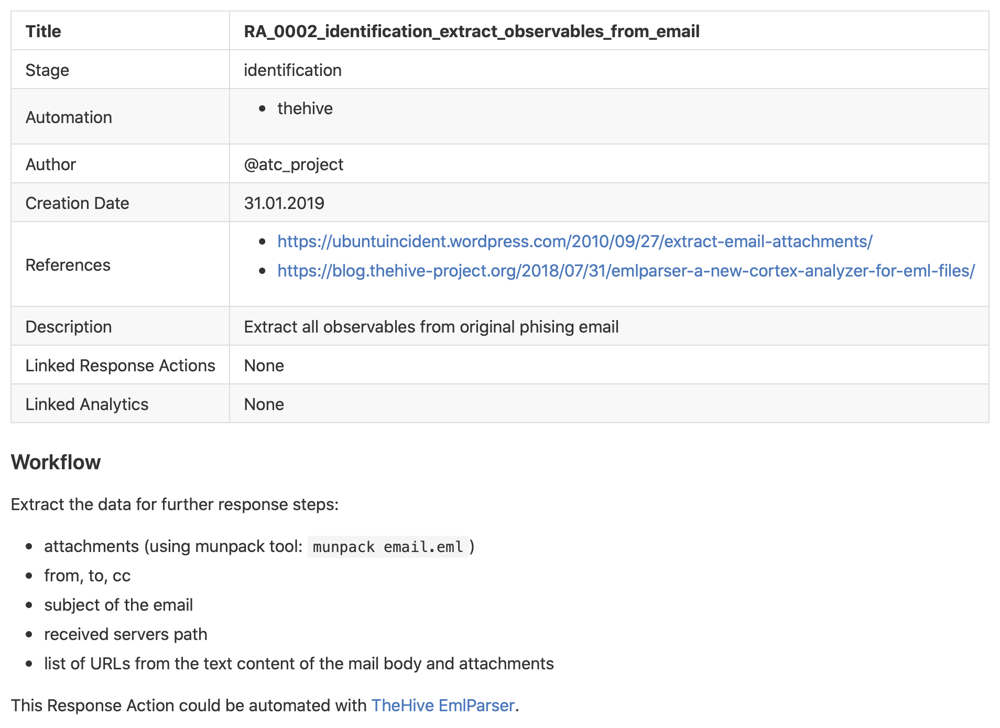

# ATC Response

Actionable Security Incident Response Playbooks.

## Description

ATC Response is a sub-project of [Atomic Threat Coverage](https://github.com/atc-project/atomic-threat-coverage) framework, related to Security Incident Response process.

It represents the following:

1. A collection of Security Incident Response Playbooks
2. A data source of the [Atomic Threat Coverage](https://github.com/atc-project/atomic-threat-coverage) framework

### Actionable Playbooks

The ATC Response project inherits the "Actionable Analytics" paradigm from the parent project, which means that the analytics are:

- **human-readable** (`.markdown`) for sharing/using in operations
- **machine-readable** (`.yaml`) for automatic processing/integrations
- **executable** by Incident Response Platform ([TheHive Case Templates](analytics/generated/thehive_templates/) only, at the moment)

Simply saying, the analytics are stored in `.yaml` files, that are automatically converted to `.markdown` documents (with [jinja](https://palletsprojects.com/p/jinja/)) and `.json` TheHive Case Templates.

#### Response Action

is a description of a specific atomic procedure/task that has to be executed during the Incident Response. It is an initial entity that is used to construct Response Playbooks and TheHive Case Templates' tasks. 

Here is an example of Response Action:

  
Initial YAML file (click to expand)

  

  
Automatically created Markdown file (click to expand)

  

 

Each Response Action mapped to a specific stage of [The Six Stages of Incident Response Process](https://www.cynet.com/incident-response/incident-response-sans-the-6-steps-in-depth/).

#### Response Playbook

is an Incident Response plan, that represents a complete list of procedures/tasks (Response Actions) that has to be executed to respond to a specific threat with optional mapping to the [MITRE's ATT&CK](https://attack.mitre.org/) or [Credibility Coalition's AMITT](https://medium.com/@credibilitycoalition/misinfosec-framework-99e3bff5935d) frameworks.

Here is an example of Response Playbook:

  
Initial YAML file (click to expand)

  

  
Automatically created Markdown file (click to expand)

  

 
Response Playbook could include a description of the workflow, specific conditions/requirements or details on the order of Response Actions execution.

#### TheHive Case Templates

are built on top of the Response Playbooks. Each task in a Case Template is a Response Action (with full description). 

Here is the example of an imported TheHive Case Template:

  
Imported TheHive Case Template, made on top of a Response Playbook (click to expand)

  

  
One of the Tasks in TheHive Case, made on top of a Response Action (click to expand)

  

TheHive Case Templates could be found in `generated_analytics/thehive_templates` directory and could be imported to TheHive via its web interface.

### Data source of ATC framework

ATC Response project plays a role of data source for the [Atomic Threat Coverage](https://github.com/atc-project/atomic-threat-coverage) framework, that uses it generating markdown and confluence knowledge bases, ATT&CK Navigator profiles, Elasticsearch indexes and [other](https://github.com/atc-project/atomic-threat-coverage#how-it-works) analytics. 

Originally it was a part of the ATC, but we decided to move it into a separate project to make it easier to maintain and provide an option for integration with other projects in this area. 

## Contacts

- Folow us on [Twitter](https://twitter.com/atc_project) for updates
- Join discussions in [Slack](https://join.slack.com/t/atomicthreatcoverage/shared_invite/enQtNTMwNDUyMjY2MTE5LTk1ZTY4NTBhYjFjNjhmN2E3OTMwYzc4MTEyNTVlMTVjMDZmMDg2OWYzMWRhMmViMjM5YmM1MjhkOWFmYjE5MjA) or [Telegram](https://t.me/atomic_threat_coverage) 

## Authors

- Jakob Weinzettl, [@mrblacyk](https://github.com/mrblacyk)
- Mateusz Wydra, [@sn0w0tter](https://github.com/sn0w0tter)
- Daniil Yugoslavskiy, [@yugoslavskiy](https://github.com/yugoslavskiy)

## Contributors

Would you like to become one? You are very welcome! Use [CONTRIBUTING](https://github.com/atc-project/atomic-threat-coverage/blob/master/CONTRIBUTING.md) guidelines to contribute to the main project.

## License

See the [LICENSE](LICENSE) file.