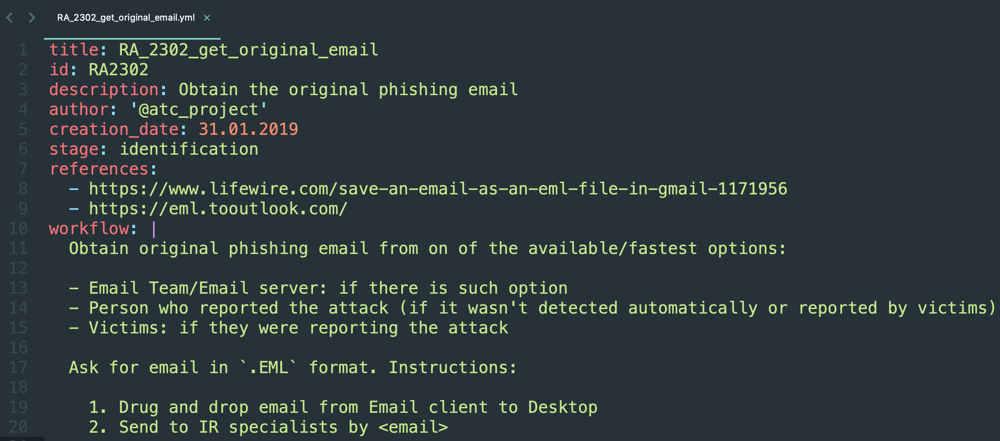
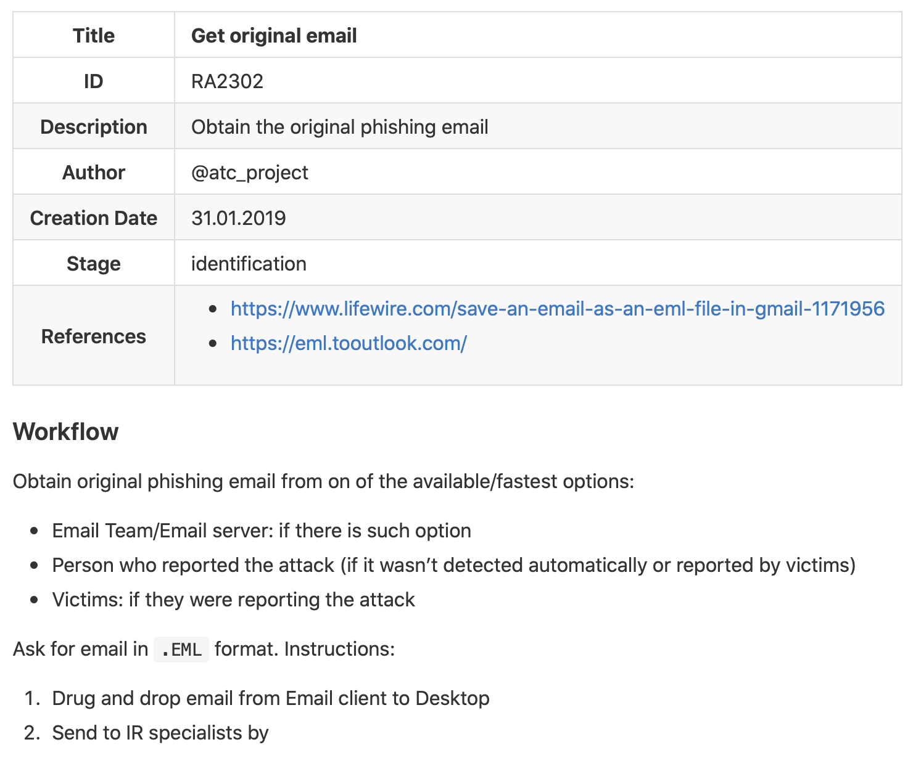
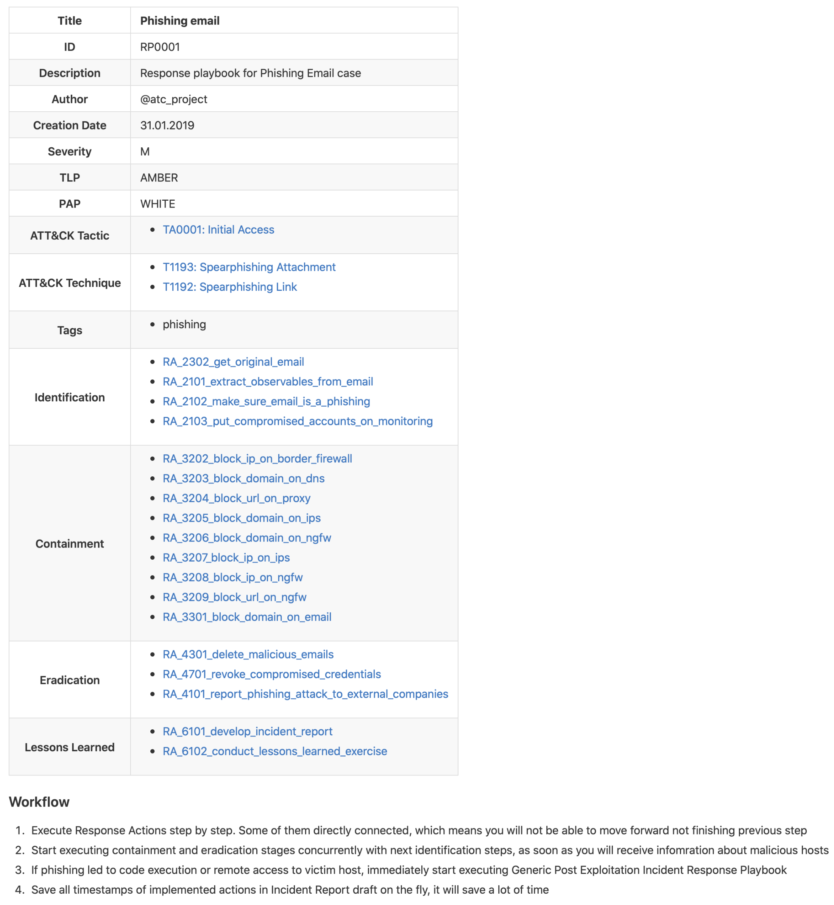

# ATC RE&CT


The project represents the following:

1. A framework for Incident Response techniques representation
2. A [collection](https://github.com/atc-project/atc-response/tree/master/generated_analytics/markdown_documents/Response_Playbooks) of Security Incident Response Playbooks
3. A data source of the [Atomic Threat Coverage](https://github.com/atc-project/atomic-threat-coverage) framework

## The Framework

is designed for accumulating, describing and understanding Incident Response techniques.  
RE&CT's philosophy is based on the [MITRE's ATT&CK](https://attack.mitre.org/) framework.  
The collumns repsresent stages of [The Six Stages of Incident Response Process](https://www.cynet.com/incident-response/incident-response-sans-the-6-steps-in-depth/).  
The cells repsresent [Response Actions](#response-action).  

| Preparation                                           | Identification                           | Containment                           | Eradication                                    | Recovery                                    | Lessons Learned                    |
|-------------------------------------------------------|------------------------------------------|---------------------------------------|------------------------------------------------|---------------------------------------------|------------------------------------|
| [Take trainings]                                      | [Get original email]                     | [Block domain on email]               | [Delete malicious emails]                      | [Reinstall host from golden image*]         | [Develop incident report]          |
| [Practice]                                            | [Extract observables from email]         | [Block IP on border firewall]         | [Revoke compromised credentials]               |                                             | [Conduct Lessons Learned exercise] |
| [Raise personnel awareness*]                          | [Make sure email is a phishing]          | [Block domain on DNS]                 | [Report phishing attack to external companies] |                                             |                                    |
| [Make personnel report suspicious activity*]          | [Put compromised accounts on monitoring] | [Block URL on Proxy]                  | [Report incident to external companies]        |                                             |                                    |
| [Set up relevant data collection*]                    | [Analyse filehash*]                      | [Block domain on IPS]                 | [Remove file from host*]                       |                                             |                                    |
| [Set up a centralized long-term log storage*]         | [Analyse IP*]                            | [Block domain on NGFW]                |                                                |                                             |                                    |
| [Develop communication map*]                          | [Analyse macOS Mach-O*]                  | [Block IP on IPS]                     |                                                |                                             |                                    |
| [Make sure there are backups*]                        | [Analyse MS Office file*]                | [Block IP on NGFW]                    |                                                |                                             |                                    |
| [Get network architecture map*]                       | [Analyse PDF*]                           | [Block URL on NGFW]                   |                                                |                                             |                                    |
| [Get access control matrix*]                          | [Analyse Unix ELF*]                      | [Block sender on email*]              |                                                |                                             |                                    |
| [Develop assets knowledge base*]                      | [Analyse URI*]                           | [Block port on ngfw*]                 |                                                |                                             |                                    |
| [Check analysis toolset*]                             | [Analyse MS Windows PE*]                 | [Block port on border firewall*]      |                                                |                                             |                                    |
| [Access vulnerability management system logs*]        | [List processes executed*]               | [Block ip on intranet firewall*]      |                                                |                                             |                                    |
| [Access internet communication netflow logs*]         | [List services executed*]                | [Block port on intranet firewall*]    |                                                |                                             |                                    |
| [Access intranet communication netflow logs*]         | [List users opened email*]               | [Block ip on host firewall*]          |                                                |                                             |                                    |
| [Access firewall logs*]                               | [List registry keys modified*]           | [Block port on host firewall*]        |                                                |                                             |                                    |
| [Access NGFW logs*]                                   | [List hosts communicated with domain*]   | [Block domain on proxy*]              |                                                |                                             |                                    |
| [Access Proxy logs*]                                  | [List hosts communicated with IP*]       | [Block user on proxy*]                |                                                |                                             |                                    |
| [Access DNS logs*]                                    | [List hosts communicated with URL*]      | [Block user on ngfw*]                 |                                                |                                             |                                    |
| [Access VPN logs*]                                    | [List files created*]                    | [Quarantine file by format*]          |                                                |                                             |                                    |
| [Access DHCP logs*]                                   | [List victims of security alert*]        | [Quarantine file by hash*]            |                                                |                                             |                                    |
| [Access network security monitoring system logs*]     | [Analyse domain name*]                   | [Quarantine file by path*]            |                                                |                                             |                                    |
| [Access traffic collection data*]                     | [List host vulnerabilities*]             | [Quarantine file by content pattern*] |                                                |                                             |                                    |
| [Manage border firewall rules*]                       | [List hosts communicated by port*]       | [Quarantine file by metadata*]        |                                                |                                             |                                    |
| [Manage intranet firewall rules*]                     | [List hosts connected to VPN*]           |                                       |                                                |                                             |                                    |
| [Manage host firewall rules*]                         | [List host connected to intranet*]       |                                       |                                                |                                             |                                    |
| [Manage DNS records*]                                 | [Get data transferred by FTP*]           |                                       |                                                |                                             |                                    |
| [Manage Proxy rules*]                                 | [Get data transferred by SMB*]           |                                       |                                                |                                             |                                    |
| [Manage IPS rules*]                                   | [Get data transferred by HTTP*]          |                                       |                                                |                                             |                                    |
| [Manage NGFW rules*]                                  | [List email receivers*]                  |                                       |                                                |                                             |                                    |
| [Get ability to find all users opened email*]         | [Find file by format*]                   |                                       |                                                |                                             |                                    |
| [Get ability to find all users received email*]       | [Find file by hash*]                     |                                       |                                                |                                             |                                    |
| [Get ability to block email domain*]                  | [Find file by path*]                     |                                       |                                                |                                             |                                    |
| [Get ability to block an email sender*]               | [Find file by content pattern*]          |                                       |                                                |                                             |                                    |
| [Get ability to delete an email*]                     | [Find file by metadata*]                 |                                       |                                                |                                             |                                    |
| [Get ability to find file by format*]                 | [List files modified*]                   |                                       |                                                |                                             |                                    |
| [Get ability to find file by hash*]                   | [List files deleted*]                    |                                       |                                                |                                             |                                    |
| [Get ability to find file by path*]                   | [List files downloaded*]                 |                                       |                                                |                                             |                                    |
| [Get ability to find file by content pattern*]        | [List files with tampered timestamps*]   |                                       |                                                |                                             |                                    |
| [Get ability to find file by metadata*]               | [Download file from host*]               |                                       |                                                |                                             |                                    |
| [Get ability to find files with tampered timestamps*] |                                          |                                       |                                                |                                             |                                    |
| [Get ability to list files modified*]                 |                                          |                                       |                                                |                                             |                                    |
| [Get ability to list files deleted*]                  |                                          |                                       |                                                |                                             |                                    |
| [Get ability to list files downloaded*]               |                                          |                                       |                                                |                                             |                                    |
| [Get ability to download file from host*]             |                                          |                                       |                                                |                                             |                                    |
| [Manage remote computer management system policies*]  |                                          |                                       |                                                |                                             |                                    |
| [Get ability to quarantine file by format*]           |                                          |                                       |                                                |                                             |                                    | 
| [Get ability to quarantine file by hash*]             |                                          |                                       |                                                |                                             |                                    | 
| [Get ability to quarantine file by path*]             |                                          |                                       |                                                |                                             |                                    | 
| [Get ability to quarantine file by content pattern*]  |                                          |                                       |                                                |                                             |                                    | 
| [Get ability to quarantine file by metadata*]         |                                          |                                       |                                                |                                             |                                    | 
| [Get ability to remove file from host*]               |                                          |                                       |                                                |                                             |                                    | 
     

[Take trainings]: generated_analytics/markdown_documents/Response_Actions/RA_1102_take_trainings.md
[Practice]: generated_analytics/markdown_documents/Response_Actions/RA_1101_practice.md
[Get original email]: generated_analytics/markdown_documents/Response_Actions/RA_2302_get_original_email.md
[Extract observables from email]: generated_analytics/markdown_documents/Response_Actions/RA_2101_extract_observables_from_email.md
[Make sure email is a phishing]: generated_analytics/markdown_documents/Response_Actions/RA_2102_make_sure_email_is_a_phishing.md
[Put compromised accounts on monitoring]: generated_analytics/markdown_documents/Response_Actions/RA_2103_put_compromised_accounts_on_monitoring.md
[Block domain on email]: generated_analytics/markdown_documents/Response_Actions/RA_3301_block_domain_on_email.md
[Block IP on border firewall]: generated_analytics/markdown_documents/Response_Actions/RA_3202_block_ip_on_border_firewall.md
[Block domain on DNS]: generated_analytics/markdown_documents/Response_Actions/RA_3203_block_domain_on_dns.md
[Block URL on Proxy]: generated_analytics/markdown_documents/Response_Actions/RA_3204_block_url_on_proxy.md
[Block domain on IPS]: generated_analytics/markdown_documents/Response_Actions/RA_3205_block_domain_on_ips.md
[Block domain on NGFW]: generated_analytics/markdown_documents/Response_Actions/RA_3206_block_domain_on_ngfw.md
[Block IP on IPS]: generated_analytics/markdown_documents/Response_Actions/RA_3207_block_ip_on_ips.md
[Block IP on NGFW]: generated_analytics/markdown_documents/Response_Actions/RA_3208_block_ip_on_ngfw.md
[Block URL on NGFW]: generated_analytics/markdown_documents/Response_Actions/RA_3209_block_url_on_ngfw.md
[Delete malicious emails]: generated_analytics/markdown_documents/Response_Actions/RA_4301_delete_malicious_emails.md
[Revoke compromised credentials]: generated_analytics/markdown_documents/Response_Actions/RA_4701_revoke_compromised_credentials.md
[Report phishing attack to external companies]: generated_analytics/markdown_documents/Response_Actions/RA_4101_report_phishing_attack_to_external_companies.md
[Report incident to external companies]: generated_analytics/markdown_documents/Response_Actions/RA_4102_report_incident_to_external_companies.md
[Develop incident report]: generated_analytics/markdown_documents/Response_Actions/RA_6101_develop_incident_report.md
[Conduct Lessons Learned exercise]: generated_analytics/markdown_documents/Response_Actions/RA_6102_conduct_lessons_learned_exercise.md


[Raise personnel awareness*]: generated_analytics/markdown_documents/Response_Actions/RA_1103_raise_personnel_awareness.md
[Make personnel report suspicious activity*]: generated_analytics/markdown_documents/Response_Actions/RA_1104_make_personnel_report_suspicious_activity.md
[Set up relevant data collection*]: generated_analytics/markdown_documents/Response_Actions/RA_1105_set_up_relevant_data_collection.md
[Set up a centralized long-term log storage*]: generated_analytics/markdown_documents/Response_Actions/RA_1106_set_up_a_centralized_long-term_log_storage.md
[Develop communication map*]: generated_analytics/markdown_documents/Response_Actions/RA_1107_develop_communication_map.md
[Make sure there are backups*]: generated_analytics/markdown_documents/Response_Actions/RA_1108_make_sure_there_are_backups.md
[Get network architecture map*]: generated_analytics/markdown_documents/Response_Actions/RA_1109_get_network_architecture_map.md
[Get access control matrix*]: generated_analytics/markdown_documents/Response_Actions/RA_1110_get_access_control_matrix.md
[Develop assets knowledge base*]: generated_analytics/markdown_documents/Response_Actions/RA_1111_develop_assets_knowledge_base.md
[Check analysis toolset*]: generated_analytics/markdown_documents/Response_Actions/RA_1112_check_analysis_toolset.md
[Access vulnerability management system logs*]: generated_analytics/markdown_documents/Response_Actions/RA_1113_access_vulnerability_management_system_logs.md
[Access internet communication netflow logs*]: generated_analytics/markdown_documents/Response_Actions/RA_1201_access_internet_communication_netflow_logs.md
[Access intranet communication netflow logs*]: generated_analytics/markdown_documents/Response_Actions/RA_1202_access_intranet_communication_netflow_logs.md
[Access firewall logs*]: generated_analytics/markdown_documents/Response_Actions/RA_1203_access_firewall_logs.md
[Access NGFW logs*]: generated_analytics/markdown_documents/Response_Actions/RA_1204_access_ngfw_logs.md
[Access Proxy logs*]: generated_analytics/markdown_documents/Response_Actions/RA_1205_access_proxy_logs.md
[Access DNS logs*]: generated_analytics/markdown_documents/Response_Actions/RA_1206_access_dns_logs.md
[Access VPN logs*]: generated_analytics/markdown_documents/Response_Actions/RA_1207_access_vpn_logs.md
[Access DHCP logs*]: generated_analytics/markdown_documents/Response_Actions/RA_1208_access_dhcp_logs.md
[Access network security monitoring system logs*]: generated_analytics/markdown_documents/Response_Actions/RA_1209_access_network_security_monitoring_system_logs.md
[Access traffic collection data*]: generated_analytics/markdown_documents/Response_Actions/RA_1210_access_traffic_collection_data.md
[Manage border firewall rules*]: generated_analytics/markdown_documents/Response_Actions/RA_1211_manage_border_firewall_rules.md
[Manage intranet firewall rules*]: generated_analytics/markdown_documents/Response_Actions/RA_1212_manage_intranet_firewall_rules.md
[Manage host firewall rules*]: generated_analytics/markdown_documents/Response_Actions/RA_1213_manage_host_firewall_rules.md
[Manage DNS records*]: generated_analytics/markdown_documents/Response_Actions/RA_1214_manage_dns_records.md
[Manage Proxy rules*]: generated_analytics/markdown_documents/Response_Actions/RA_1215_manage_proxy_rules.md
[Manage IPS rules*]: generated_analytics/markdown_documents/Response_Actions/RA_1216_manage_ips_rules.md
[Manage NGFW rules*]: generated_analytics/markdown_documents/Response_Actions/RA_1217_manage_ngfw_rules.md
[Get ability to find all users opened email*]: generated_analytics/markdown_documents/Response_Actions/RA_1301_get_ability_to_find_all_users_opened_email.md
[Get ability to find all users received email*]: generated_analytics/markdown_documents/Response_Actions/RA_1302_get_ability_to_find_all_users_received_email.md
[Get ability to block email domain*]: generated_analytics/markdown_documents/Response_Actions/RA_1303_get_ability_to_block_email_domain.md
[Get ability to block an email sender*]: generated_analytics/markdown_documents/Response_Actions/RA_1304_get_ability_to_block_an_email_sender.md
[Get ability to delete an email*]: generated_analytics/markdown_documents/Response_Actions/RA_1305_get_ability_to_delete_an_email.md
[Get ability to find file by format*]: generated_analytics/markdown_documents/Response_Actions/RA_1401_get_ability_to_find_file_by_format.md
[Get ability to find file by hash*]: generated_analytics/markdown_documents/Response_Actions/RA_1402_get_ability_to_find_file_by_hash.md
[Get ability to find file by path*]: generated_analytics/markdown_documents/Response_Actions/RA_1403_get_ability_to_find_file_by_path.md
[Get ability to find file by content pattern*]: generated_analytics/markdown_documents/Response_Actions/RA_1404_get_ability_to_find_file_by_content_pattern.md
[Get ability to find file by metadata*]: generated_analytics/markdown_documents/Response_Actions/RA_1405_get_ability_to_find_file_by_metadata.md
[Get ability to find files with tampered timestamps*]: generated_analytics/markdown_documents/Response_Actions/RA_1406_get_ability_to_find_files_with_tampered_timestamps.md
[Get ability to list files modified*]: generated_analytics/markdown_documents/Response_Actions/RA_1407_get_ability_to_list_files_modified.md
[Get ability to list files deleted*]: generated_analytics/markdown_documents/Response_Actions/RA_1408_get_ability_to_list_files_deleted.md
[Get ability to list files downloaded*]: generated_analytics/markdown_documents/Response_Actions/RA_1409_get_ability_to_list_files_downloaded.md
[Get ability to download file from host*]: generated_analytics/markdown_documents/Response_Actions/RA_1410_get_ability_to_download_file_from_host.md
[Manage remote computer management system policies*]: generated_analytics/markdown_documents/Response_Actions/RA_1601_manage_remote_computer_management_system_policies.md
[Get ability to quarantine file by format*]: generated_analytics/markdown_documents/Response_Actions/RA_1411_get_ability_to_quarantine_file_by_format.md
[Get ability to quarantine file by hash*]: generated_analytics/markdown_documents/Response_Actions/RA_1412_get_ability_to_quarantine_file_by_hash.md
[Get ability to quarantine file by path*]: generated_analytics/markdown_documents/Response_Actions/RA_1413_get_ability_to_quarantine_file_by_path.md
[Get ability to quarantine file by content pattern*]: generated_analytics/markdown_documents/Response_Actions/RA_1414_get_ability_to_quarantine_file_by_content_pattern.md
[Get ability to quarantine file by metadata*]: generated_analytics/markdown_documents/Response_Actions/RA_1415_get_ability_to_quarantine_file_by_metadata.md
[Get ability to remove file from host*]: generated_analytics/markdown_documents/Response_Actions/RA_1416_get_ability_to_remove_file_from_host.md
[Block sender on email*]: generated_analytics/markdown_documents/Response_Actions/RA_3302_block_sender_on_email.md
[Block port on ngfw*]: generated_analytics/markdown_documents/Response_Actions/RA_3201_block_port_on_ngfw.md
[Block port on border firewall*]: generated_analytics/markdown_documents/Response_Actions/RA_3210_block_port_on_border_firewall.md
[Block ip on intranet firewall*]: generated_analytics/markdown_documents/Response_Actions/RA_3211_block_ip_on_intranet_firewall.md
[Block port on intranet firewall*]: generated_analytics/markdown_documents/Response_Actions/RA_3212_block_port_on_intranet_firewall.md
[Block ip on host firewall*]: generated_analytics/markdown_documents/Response_Actions/RA_3213_block_ip_on_host_firewall.md
[Block port on host firewall*]: generated_analytics/markdown_documents/Response_Actions/RA_3214_block_port_on_host_firewall.md
[Block domain on proxy*]: generated_analytics/markdown_documents/Response_Actions/RA_3215_block_domain_on_proxy.md
[Block user on proxy*]: generated_analytics/markdown_documents/Response_Actions/RA_3216_block_user_on_proxy.md
[Block user on ngfw*]: generated_analytics/markdown_documents/Response_Actions/RA_3217_block_user_on_ngfw.md
[Quarantine file by format*]: generated_analytics/markdown_documents/Response_Actions/RA_3401_quarantine_file_by_format.md
[Quarantine file by hash*]: generated_analytics/markdown_documents/Response_Actions/RA_3402_quarantine_file_by_hash.md
[Quarantine file by path*]: generated_analytics/markdown_documents/Response_Actions/RA_3403_quarantine_file_by_path.md
[Quarantine file by content pattern*]: generated_analytics/markdown_documents/Response_Actions/RA_3404_quarantine_file_by_content_pattern.md
[Quarantine file by metadata*]: generated_analytics/markdown_documents/Response_Actions/RA_3405_quarantine_file_by_metadata.md
[List host vulnerabilities*]: generated_analytics/markdown_documents/Response_Actions/RA_2105_list_host_vulnerabilities.md
[List hosts communicated by port*]: generated_analytics/markdown_documents/Response_Actions/RA_2207_list_hosts_communicated_by_port.md
[List hosts connected to VPN*]: generated_analytics/markdown_documents/Response_Actions/RA_2208_list_hosts_connected_to_vpn.md
[List host connected to intranet*]: generated_analytics/markdown_documents/Response_Actions/RA_2209_list_host_connected_to_intranet.md
[Get data transferred by FTP*]: generated_analytics/markdown_documents/Response_Actions/RA_2210_get_data_transferred_by_ftp.md
[Get data transferred by SMB*]: generated_analytics/markdown_documents/Response_Actions/RA_2211_get_data_transferred_by_smb.md
[Get data transferred by HTTP*]: generated_analytics/markdown_documents/Response_Actions/RA_2212_get_data_transferred_by_http.md
[List email receivers*]: generated_analytics/markdown_documents/Response_Actions/RA_2303_list_email_receivers.md
[Find file by format*]: generated_analytics/markdown_documents/Response_Actions/RA_2409_find_file_by_format.md
[Find file by hash*]: generated_analytics/markdown_documents/Response_Actions/RA_2410_find_file_by_hash.md
[Find file by path*]: generated_analytics/markdown_documents/Response_Actions/RA_2411_find_file_by_path.md
[Find file by content pattern*]: generated_analytics/markdown_documents/Response_Actions/RA_2412_find_file_by_content_pattern.md
[Find file by metadata*]: generated_analytics/markdown_documents/Response_Actions/RA_2413_find_file_by_metadata.md
[List files modified*]: generated_analytics/markdown_documents/Response_Actions/RA_2414_list_files_modified.md
[List files deleted*]: generated_analytics/markdown_documents/Response_Actions/RA_2415_list_files_deleted.md
[List files downloaded*]: generated_analytics/markdown_documents/Response_Actions/RA_2416_list_files_downloaded.md
[List files with tampered timestamps*]: generated_analytics/markdown_documents/Response_Actions/RA_2417_list_files_with_tampered_timestamps.md
[Download file from host*]: generated_analytics/markdown_documents/Response_Actions/RA_2418_download_file_from_host.md
[Remove file from host*]: generated_analytics/markdown_documents/Response_Actions/RA_4401_remove_file_from_host.md
[Analyse domain name*]: generated_analytics/markdown_documents/Response_Actions/RA_2204_analyse_domain_name.md
[Analyse filehash*]: generated_analytics/markdown_documents/Response_Actions/RA_2404_analyse_filehash.md
[Analyse IP*]: generated_analytics/markdown_documents/Response_Actions/RA_2205_analyse_ip.md
[Analyse macOS Mach-O*]: generated_analytics/markdown_documents/Response_Actions/RA_2405_analyse_macos_macho.md
[Analyse MS Office file*]: generated_analytics/markdown_documents/Response_Actions/RA_2406_analyse_ms_office_file.md
[Analyse PDF*]: generated_analytics/markdown_documents/Response_Actions/RA_2407_analyse_pdf.md
[Analyse Unix ELF*]: generated_analytics/markdown_documents/Response_Actions/RA_2408_analyse_unix_elf.md
[Analyse URI*]: generated_analytics/markdown_documents/Response_Actions/RA_2206_analyse_uri.md
[Analyse MS Windows PE*]: generated_analytics/markdown_documents/Response_Actions/RA_2402_analyse_windows_pe.md
[List processes executed*]: generated_analytics/markdown_documents/Response_Actions/RA_2403_list_processes_executed.md
[List services executed*]: generated_analytics/markdown_documents/Response_Actions/RA_2501_list_services_executed.md
[List users opened email*]: generated_analytics/markdown_documents/Response_Actions/RA_2301_list_users_opened_email.md
[List registry keys modified*]: generated_analytics/markdown_documents/Response_Actions/RA_2601_list_registry_keys_modified.md
[List hosts communicated with domain*]: generated_analytics/markdown_documents/Response_Actions/RA_2201_list_hosts_communicated_with_domain.md
[List hosts communicated with IP*]: generated_analytics/markdown_documents/Response_Actions/RA_2202_list_hosts_communicated_with_ip.md
[List hosts communicated with URL*]: generated_analytics/markdown_documents/Response_Actions/RA_2203_list_hosts_communicated_with_url.md
[List files created*]: generated_analytics/markdown_documents/Response_Actions/RA_2401_list_files_created.md
[List victims of security alert*]: generated_analytics/markdown_documents/Response_Actions/RA_2104_list_victims_of_security_alert.md
[Reinstall host from golden image*]: generated_analytics/markdown_documents/Response_Actions/RA_5101_reinstall_host_from_golden_image.md

## Actionable Playbooks

The ATC RE&CT project inherits the "Actionable Analytics" paradigm from the [ATC](https://github.com/atc-project/atomic-threat-coverage) project, which means that the analytics are:

- **human-readable** (`.markdown`) for sharing/using in operations
- **machine-readable** (`.yaml`) for automatic processing/integrations
- **executable** by Incident Response Platform ([TheHive Case Templates](analytics/generated/thehive_templates/) only, at the moment)

Simply saying, the analytics are stored in `.yaml` files, that are automatically converted to `.markdown` documents (with [jinja](https://palletsprojects.com/p/jinja/)) and `.json` TheHive Case Templates.

### Response Action

is a description of a specific atomic procedure/task that has to be executed during the Incident Response. It is an initial entity that is used to construct Response Playbooks and TheHive Case Templates' tasks. 

Here is an example of Response Action:

<details>
  <summary>Initial YAML file (click to expand)</summary>
  
</details>

<details>
  <summary>Automatically created Markdown file (click to expand)</summary>
  
</details>

<details>
  <summary>Automatically created (by main ATC project) Confluence page (click to expand)</summary>
  
</details>

Each Response Action mapped to a specific stage of [The Six Stages of Incident Response Process](https://www.cynet.com/incident-response/incident-response-sans-the-6-steps-in-depth/).

### Response Playbook

is an Incident Response plan, that represents a complete list of procedures/tasks (Response Actions) that has to be executed to respond to a specific threat with optional mapping to the [MITRE's ATT&CK](https://attack.mitre.org/) or [Misinfosec's  AMITT](https://github.com/misinfosecproject/amitt_framework) frameworks.

Here is an example of Response Playbook:

<details>
  <summary>Initial YAML file (click to expand)</summary>
  
</details>

<details>
  <summary>Automatically created Markdown file (click to expand)</summary>
  
</details>

<details>
  <summary>Automatically created (by main ATC project) Confluence page (click to expand)</summary>
  
</details>

Response Playbook could include a description of the workflow, specific conditions/requirements or details on the order of Response Actions execution.

### TheHive Case Templates

are built on top of the Response Playbooks. Each task in a Case Template is a Response Action (with full description). 

Here is the example of an imported TheHive Case Template:

<details>
  <summary>Imported TheHive Case Template, made on top of a Response Playbook (click to expand)</summary>
  
</details>

<details>
  <summary>One of the Tasks in TheHive Case, made on top of a Response Action (click to expand)</summary>
  
</details>

TheHive Case Templates could be found in `generated_analytics/thehive_templates` directory and could be imported to TheHive via its web interface.

## Data source of the ATC framework

ATC RE&CT project plays a role of data source for the [Atomic Threat Coverage](https://github.com/atc-project/atomic-threat-coverage) framework, that uses it to generate markdown and confluence knowledge bases, ATT&CK Navigator profiles, Elasticsearch indexes and [other](https://github.com/atc-project/atomic-threat-coverage#how-it-works) analytics. 

Originally it was a part of the ATC, but we decided to move it into a separate project to make it easier to maintain and provide an option for integration with other projects in this area. 

## Usage

1. Make sure you are compliant with the [requirements](#requirements)

2. Modify existing `.yaml` files, or develop your own analytics using the templates of [Response Actions](response_actions/respose_action.yml.template) or [Response Playbooks](response_playbooks/respose_playbook.yml.template). They should be stored in the directories according to their type.

3. When `.yaml` files are ready, convert them to `.markdown` documents and TheHive templates using the following commands:
    ```
    python3 main.py --markdown --auto --init
    python3 main.py --thehive
    ```
    You will find the outcome in the `generated_analytics` directory.

### Requirements

- Python 3.7
- [PyYAML](https://pypi.org/project/PyYAML/) and [jinja2](https://pypi.org/project/Jinja2/) Python libraries. They could be installed with the next command:
    ```
    python3 -m pip install -r requirements.txt
    ```

## Contacts

- Folow us on [Twitter](https://twitter.com/atc_project) for updates
- Join discussions in [Slack](https://join.slack.com/t/atomicthreatcoverage/shared_invite/enQtNTMwNDUyMjY2MTE5LTk1ZTY4NTBhYjFjNjhmN2E3OTMwYzc4MTEyNTVlMTVjMDZmMDg2OWYzMWRhMmViMjM5YmM1MjhkOWFmYjE5MjA) or [Telegram](https://t.me/atomic_threat_coverage) 

## Authors

- Jakob Weinzettl, [@mrblacyk](https://github.com/mrblacyk)
- Mateusz Wydra, [@sn0w0tter](https://github.com/sn0w0tter)
- Daniil Yugoslavskiy, [@yugoslavskiy](https://github.com/yugoslavskiy)

## Contributors

Would you like to become one? You are very welcome! Use [CONTRIBUTING](https://github.com/atc-project/atomic-threat-coverage/blob/master/CONTRIBUTING.md) guidelines to contribute to the main project.

## License

See the [LICENSE](LICENSE) file.