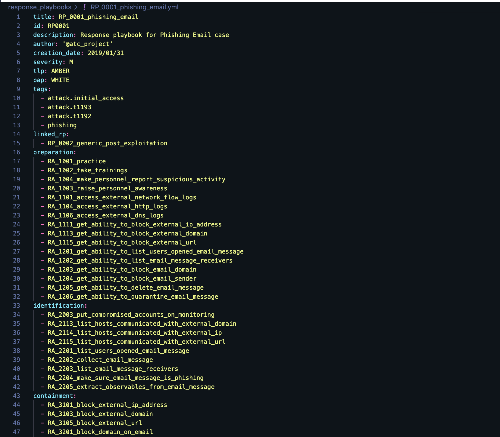

[English version](README.md)

# RE&CT


Проект представляет собой:

1. [Фреймворк](https://atc-project.github.io/atc-react/) для техник реагирования на инциденты компьютерной безопасности (Computer Security Incident Response)  
3. [Набор](docs/Response_Playbooks) Сценариев Реагирования на инциденты (Incident Response Playbooks), развиваемый сообществом  
3. Источник данных для проекта [Atomic Threat Coverage](https://github.com/atc-project/atomic-threat-coverage)  

## Фреймворк RE&CT

Фреймворк создан для накопления, описания и классификации действенных техник реагирования на инциденты.  

Философия RE&CT основана на подходе фреймворка [MITRE ATT&CK](https://attack.mitre.org/).  
Столбцы представляют собой [Стадии Реагирования (Response Stages)](https://atc-project.github.io/atc-react/responsestages/).  
Ячейки представляют собой [Действия Реагирования (Response Actions)](#response-action).  


<p align="center">(Изображение сгенерировано посредством <a href="https://atc-project.github.io/react-navigator/">RE&CT Navigator)</a></p>

Основные варианты использования:

- Приоритизация задач по созданию и совершенствованию процесса реагирования на инциденты, включая развитие компетенций, внедрение технических средств, разработку регламентов и т.д.
- Анализ недочетов — определение "степени покрытия" матрицы RE&CT уже реализованными функциями реагирования на инциденты

Основные ресурсы:

- [RE&CT Navigator](https://atc-project.github.io/react-navigator/) (модифицированный [ATT&CK Navigator](https://github.com/mitre-attack/attack-navigator)) для визуализации и анализа общей картины  
- Автоматически сгенерированный [веб-сайт](https://atc-project.github.io/atc-react/) фреймворка RE&CT — лучшее место для детального изучения существующих техник реагирования на инциденты  
- Автоматически сгенерированная [база знаний в Atlassian Confluence](https://atomicthreatcoverage.atlassian.net/wiki/spaces/REACT/pages/755469668/Response+Stages) — демонстрация функции по экспорта аналитики  

## Действенная Аналитика

Проект ATC RE&CT наследует парадигму "Действенная Аналитика" от проекта [ATC](https://github.com/atc-project/atomic-threat-coverage).  
Это означает, что аналитика:  

- **человекочитаемая** (`.md`) для распространения/использования в ходе операционной деятельности  
- **машиночитаемая** (`.yml`) для автоматизированной обработки/интеграций  
- **исполняемая** платформой для реагирования на инциденты (Incident Response Platform, IRP). На данный момент поддерживается генерация шаблонов кейсов для IRP [TheHive](docs/thehive_templates/)  

Проще говоря, аналитика хранится в формате `.yml` файлов, автоматически конвертируется в документы в формате `.md` (посредством [jinja](https://palletsprojects.com/p/jinja/)) и `.json` файлы шаблонов кейсов TheHive.  

### Response Action

Response Action (Действие Реагирования) — это описание специфичной атомарной процедуры/задачи, которая должна быть выполнена в ходе реагирования на инцидент. Это первостепенный объект, используемый для составления Сценариев Реагирования (Response Playbooks).  

Пример Действия Реагирования:

<details>
  <summary>Изначальный YAML файл (кликните, чтобы раскрыть)</summary>
  
</details>

- Автоматически сгенерированный [файл в формате Markdown](docs/Response_Actions/RA_2202_collect_email_message.md)
- Автоматически сгенерированная [mkdocs страница](https://atc-project.github.io/atc-react/Response_Actions/RA_2202_collect_email_message/)
- Автоматически сгенерированная [страница в Confluence](https://atomicthreatcoverage.atlassian.net/wiki/spaces/REACT/pages/755435640/RA2202+Collect+email+message)

Каждое Действие Реагирования связано с конкретной [Стадией Реагирования](https://atc-project.github.io/atc-react/responsestages/).  

Первая цифра идентификатора Действия Реагирования отражает Стадию, к которой это Действие относится:

- **1**: Подготовка (Preparation)
- **2**: Идентификация (Identification)
- **3**: Сдерживание (Containment)
- **4**: Ликвидация (Eradication)
- **5**: Восстановление (Recovery)
- **6**: Выводы (Lessons Learned)

Вторая цифра идентификатора Действия Реагирования отражает Категорию, к которой это Действие относится:

- **0**: Общее (General)
- **1**: Сеть (Network)
- **2**: Электронная почта (Email)
- **3**: Файл (File)
- **4**: Процесс (Process)
- **5**: Конфигурация (Configuration)
- **6**: Идентификационные данные (Identity)

Таким образом, посредством идентификатора Действия Реагирования, можно определить Стадию и Категорию, к которым это Действие принадлежит.
Например [RA**22**02: Collect an email message](docs/Response_Actions/RA_2202_collect_email_message.md) относится к Стадии **2** (Идентификация) и Категории **2** (Электронная почта).

Категоризация предназначена для расширения возможностей для оценки зрелости и планирования развития процесса реагирования на инциденты.  

### Response Playbook

Response Playbook (Сценарий Реагирования) — это план, который представляет собой законченный список задач/процедур (Действий Реагирования) которые должны быть выполнены в ходе реагирования на конкретную угрозу с опциональным маппингом к фреймворкам [MITRE ATT&CK](https://attack.mitre.org/) или [Misinfosec AMITT](https://github.com/misinfosecproject/amitt_framework).

Пример Сценария Реагирования:

<details>
  <summary>Изначальный YAML файл (кликните, чтобы раскрыть)</summary>
  
</details>

- Автоматически сгенерированный [файл в формате Markdown](docs/Response_Playbooks/RP_0001_phishing_email.md)
- Автоматически сгенерированная [mkdocs страница](https://atc-project.github.io/atc-react/Response_Playbooks/RP_0001_phishing_email/)
- Автоматически сгенерированная [страница в Confluence](https://atomicthreatcoverage.atlassian.net/wiki/spaces/REACT/pages/755469546/RP0001+Phishing+email)

Сценарий Реагирования может включать в себя описание хода работ, особых условий/требований, детали по последовательности исполнения Действий Реагирования, или любую другую релевантную информацию.

### TheHive Case Templates

Шаблоны кейсов платформы реагирования на инциденты TheHive генерируются на основе Сценариев Реагирования.  
Каждая отдельная задача в шаблоне кейса — это отдельное Действие Реагирования (с его полным описанием).  

Вот пример импортированного шаблона кейса TheHive:

<details>
  <summary>Импортированный шаблон кейса TheHive, созданный на основе Сценария Реагирования (кликните, чтобы раскрыть)</summary>
  
</details>

<details>
  <summary>Одна из задач в кейсе TheHive, созданная на основе Действия Реагирования (кликните, чтобы раскрыть)</summary>
  
</details>

Шаблоны кейсов TheHive хранятся в директории `docs/thehive_templates` и могут быть импортированы в TheHive через его веб-интерфейс.

## Источник данных для проекта ATC

Проект ATC RE&CT играет роль источника аналитики для проекта [Atomic Threat Coverage](https://github.com/atc-project/atomic-threat-coverage), который используется для создания баз знаний в форматах Markdown и Confluence, профилей ATT&CK Navigator, индексов Elasticsearch и [иной](https://github.com/atc-project/atomic-threat-coverage#how-it-works) аналитики.

Изначально, аналитика по реагированию была частью проекта ATC, но мы решили выделить ее в отдельный проект для упрощения управления/разработки и предоставления возможности интеграции с другими проектами в данной области.

## Использование

1. Убедитесь что ваше рабочее окружение соответствует [системным требованиям](#системные-требования)

2. Создайте файл конфигурации, скопировав шаблон файла конфигурации `scripts/config.default.yml` в `config.yml` (в корень проекта). Обновите его, следуя инструкциям в шаблоне файла конфигурации.

3. Модифицируйте существующие `.yml` файлы или разработайте свою собственную аналитику, используя шаблоны [Действий Реагирования](response_actions/respose_action.yml.template) или [Сценариев Реагирования](response_playbooks/respose_playbook.yml.template). Они должны быть сохранены в соответствующих директориях.

4. Когда `.yml` будут готовы, сконвертируйте их в документы в формате `.md`, экспортируйте их в Confluence, создайте шаблоны кейсов TheHive и профиль [RE&CT Navigator](https://github.com/atc-project/react-navigator) используя следующие команды:
    ```
    python3 main.py --markdown --auto --init
    python3 main.py --confluence --auto --init
    python3 main.py --thehive
    python3 main.py -NAV
    ```
    Результат будет доступен в директории `docs` и страницах Confluence (в соответствии с конфигурацией). Профиль RE&CT Navigator можно открыть только в [кастомизированном приложении](https://github.com/atc-project/react-navigator).

5. Сгенерируйте ваш собственный (приватный) веб-сайт с вашей собственной аналитикой, используя [mkdocs](https://www.mkdocs.org/):
    ```
    python3 main.py -MK
    python3 -m mkdocs build
    ```
    Веб-сайт будет создан в директории `site`. Вы можете ознакомиться с ним посредством следующей команды:
    ```
    python3 -m mkdocs serve
    ```

### Системные требования

- Python 3.7
- Библиотеки Python — [PyYAML](https://pypi.org/project/PyYAML/), [mkdocs](https://pypi.org/project/mkdocs/), [jinja2](https://pypi.org/project/Jinja2/) и [stix2](https://pypi.org/project/stix2/) (опционально). Их можно установить посредством следующей команды:
    ```
    python3 -m pip install -r requirements.txt
    ```

## Контакты

- Следите за обновлениями в [Twitter](https://twitter.com/atc_project)
- Присоединяйтесь к обсуждению в [Slack](https://join.slack.com/t/atomicthreatcoverage/shared_invite/zt-6ropl01z-wIdiq3M0AEZPj_HiKfbiBg) или [Telegram](https://t.me/atomic_threat_coverage) 

## Контрибьюторы

- Тимур Зиннятуллин, [@zinint](https://twitter.com/zinint)  
- Даниил Светлов, [@Mr_4nders0n](https://twitter.com/Mr_4nders0n)  
- Андреас Ханкелер, [@Karneades](https://github.com/Karneades)
- Патрик Эбрэхам, [@pjabes](https://github.com/pjabes)
- Лукас Берези, [@lberezy](https://github.com/lberezy)
- Эфе Эрдур, [@efeerdur](https://github.com/efeerdur)
- Алехандро Ортуно, [@aomanzanera](https://twitter.com/aomanzanera)  
- [@d3anp](https://github.com/d3anp)  
- Кристоф Ботт, [@xofolowski](https://github.com/xofolowski)  

Вы хотели бы внести свой вклад в проект и тоже стать участником? Инструкция [CONTRIBUTING](CONTRIBUTING.md) поможет начать.  

## План развития

План развития проекта и соответствующие обсуждения можно найти в [issues](https://github.com/atc-project/atc-react/issues) посредством лейблы:

- [Обсуждения](https://github.com/atc-project/atc-react/issues?q=is%3Aissue+is%3Aopen+label%3Adiscussion)
- [Вопросы](https://github.com/atc-project/atc-react/issues?q=is%3Aissue+is%3Aopen+label%3Aquestion)
- [Улучшения](https://github.com/atc-project/atc-react/issues?q=is%3Aissue+is%3Aopen+label%3Aenhancement)
- [Разработка Действий Реагирования](https://github.com/atc-project/atc-react/issues?q=is%3Aissue+is%3Aopen+label%3ARA-dev)

## Лицензия

Лицензия доступна к просмотру по [ссылке](LICENSE).
